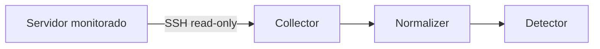

# Style guide

Última atualização: 2026-05-29

## Idioma

- **PT-BR é primário.** Toda página existe em PT primeiro.
- **EN é secundário.** Tradução em paralelo, mantida sincronizada.
- Termos técnicos sem tradução boa em itálico: *pipeline*, *worker*, *playbook*, *notifier*, *collector*, *threat intel*.
- Anglicismos consagrados sem itálico: log, container, dashboard, token, API.

## Tom

- Didático sem condescendência. Assume operador técnico (sysadmin, devsecops, SRE).
- Conversacional moderado. "Você" em vez de "o usuário".
- Direto. Frases curtas. Parágrafos curtos.
- Sem hype. "Guardian detecta X" em vez de "Guardian poderosamente identifica X".
- Honesto sobre limitações. Se feature está em beta, diga.

## Estrutura de página

```markdown
---
titulo: Tour do Dashboard
audiencia: operador
tempo_leitura: 8min
ultima_atualizacao: 2026-05-29
status: estavel | beta | planejado
---

# Tour do Dashboard

Resumo de 1-2 frases do que a página cobre.

## Sumário (só se > 3 seções H2)

- [Seção 1](#seção-1)
- [Seção 2](#seção-2)

## Seção 1

Conteúdo...

### Subseção

...

## Próximo passo

Link relativo: [Lendo alertas](02-lendo-alertas.md)

## Veja também

- [Arquitetura: noise reduction](../arquitetura/07-noise-reduction.md)
- [FAQ](../faq.md)
```

## Headers

- H1 = título da página, **um por arquivo**
- H2 = seções principais
- H3 = subseções, máximo
- Não use H4+ — se precisar, divide em arquivos

## Code blocks

Sempre com linguagem identificada:

````markdown
```bash
docker compose up -d
```

```typescript
import { db, dbDate } from './database/connection.js';
```

```sql
CREATE TABLE IF NOT EXISTS install_tokens (...);
```
````

Para output esperado, use comentário inline:

````markdown
```bash
docker compose ps
# NAME           STATUS
# guardian       running
```
````

## Caminhos

- Referência a código: `src/workers/discovery.worker.ts:42`
- Caminho de arquivo de config: `~/.guardian/.env`
- URL: usa link markdown `[texto](url)`, nunca URL crua a não ser em code block

## Listas

- Bullet (`-`) para listas não-ordenadas
- Número (`1.`) para passo-a-passo
- Tabela quando comparando atributos

## Diagramas

Mermaid pra fluxos:

````markdown

````

ASCII art simples se Mermaid for overkill:

```
config/.env  →  docker compose up  →  http://localhost:3334
```

## Avisos

```markdown
> **⚠️ Aviso:** este comando reinicia o container e perde dados não-persistidos em volume.

> **💡 Dica:** use `docker compose logs -f` em outra janela enquanto faz isso.

> **📌 Nota:** a partir da v3.1.0, esta opção é default.
```

## Convenções de exemplo

- Domínio fictício: `guardian.exemplo.com` (PT) / `guardian.example.com` (EN)
- IP exemplo: `203.0.113.42` (TEST-NET-3, RFC 5737)
- Username exemplo: `joao` (PT) / `alice` (EN)
- Token exemplo: `tok_abc123def456` (claro que é placeholder)

## O que NÃO fazer

- ❌ "Simplesmente faça X" — "simplesmente" diminui o leitor
- ❌ "Como você sabe..." — não assume conhecimento prévio sem checar
- ❌ "Obviamente..." — se fosse óbvio, não estaria documentando
- ❌ Linkar pra Wikipedia em vez de explicar o conceito quando ele importa
- ❌ Usar emoji em headers (só em avisos e tabelas comparativas)
- ❌ Capturas de tela pra coisa que muda a cada release (HTML do dashboard)
- ❌ Trocadilho em EN (a não ser que faça sentido também em PT)

## Sincronia PT ↔ EN

Quando atualizar página PT:
1. Edita `docs/pt/foo.md`
2. Atualiza `ultima_atualizacao` no frontmatter
3. Marca em `docs-status.md`: `docs/en/foo.md` está dessincronizada
4. Se a mudança for trivial (typo, link), traduz na hora
5. Se for substancial, agrupa pra batch de tradução posterior

## Quando este arquivo deve mudar

- Usuário corrigiu estilo: anota a regra aqui
- Convenção emerge organicamente em 3+ arquivos: codifica aqui
