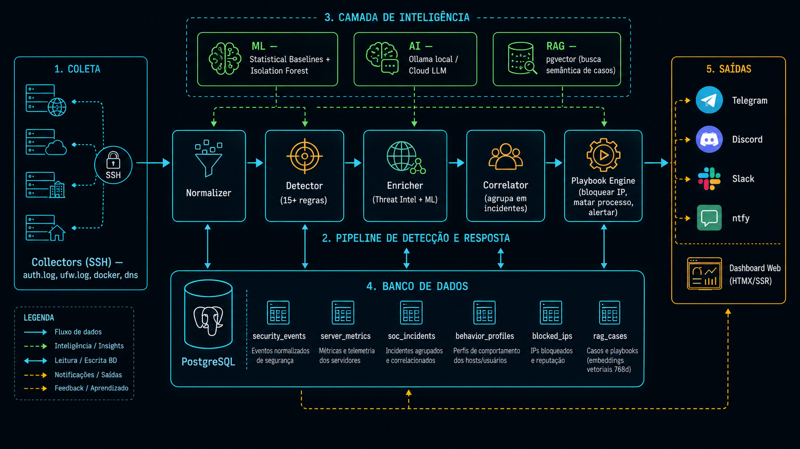
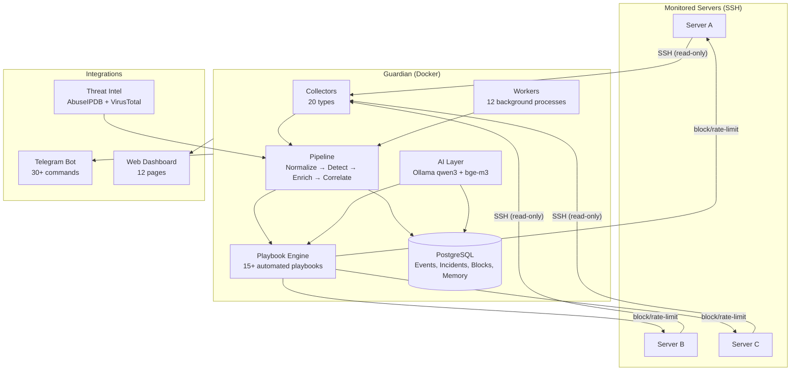
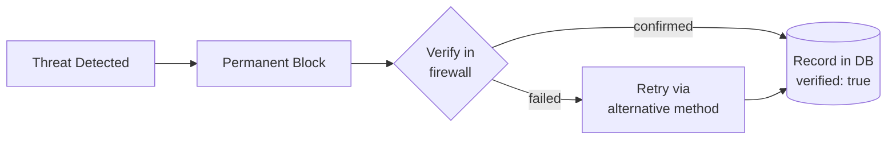
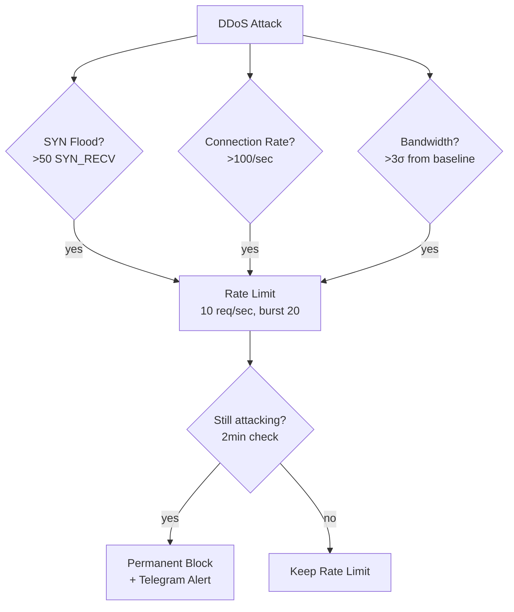
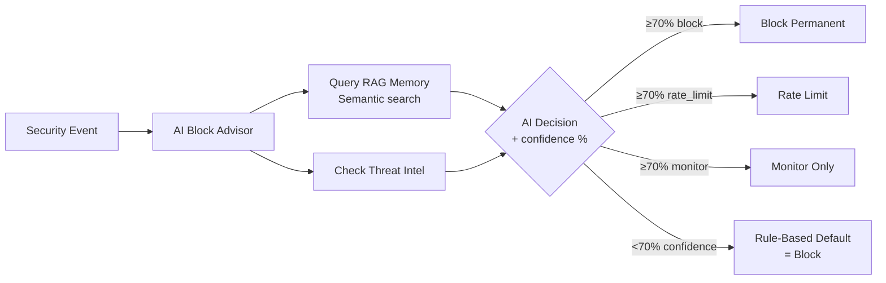
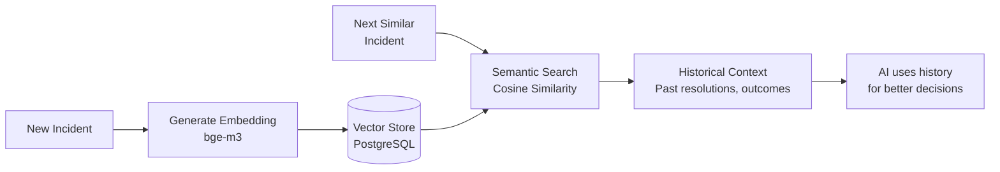
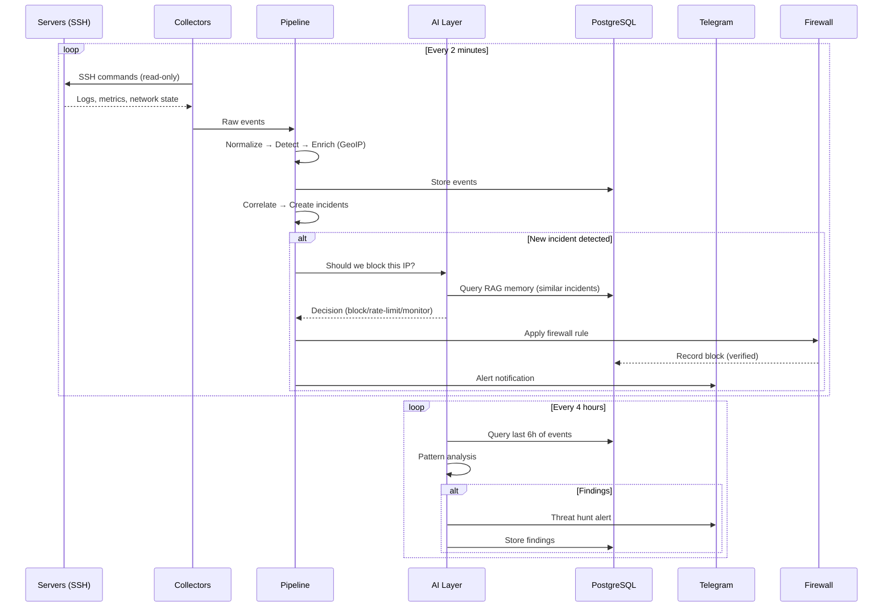

<p align="center">
  
</p>

<h1 align="center">Guardian Blue Team</h1>

<p align="center">
  <a href="https://github.com/afborda/guardian-blue-team/actions/workflows/ci.yml"></a>
  <a href="LICENSE"></a>
  <a href="https://ghcr.io/afborda/guardian-blue-team"></a>
  
</p>

<p align="center">
  <b>Agentless SIEM/SOAR with Local AI</b> — Detect, Analyze, Block, Learn<br>
  <a href="README.pt-BR.md"><strong>Portugues</strong></a> · <a href="docs/getting-started.md">Getting Started</a> · <a href="docs/architecture.md">Architecture</a> · <a href="docs/configuration.md">Configuration</a> · <a href="docs/GUARDIAN-LOG-COVERAGE.md">Log Coverage</a>
</p>

<p align="center">
  
</p>

---

**Guardian** is an agentless SIEM/SOAR that monitors your servers via SSH, detects threats in real-time, and responds automatically with permanent blocks. No agents to install, no complex setup — just point it at your servers and it starts protecting them.

It uses local AI (Ollama) for threat analysis, builds semantic memory from every incident (RAG with embeddings), hunts threats proactively every 4 hours, and provides graduated DDoS response with automatic escalation.

---

## How It Works

```mermaid
flowchart LR
    subgraph Collection["🛰️ Collection (every 2min — 20 collectors)"]
        direction TB
        SSH["SSH Auth\nUFW / Docker events"]
        NET["Network\nConnections / DNS"]
        PROC["Processes\nSudo / Packages"]
        SYS["System\nKernel / Syslog\nDisk / Reboot"]
        APP["App Logs\nNginx / MySQL\nPostgres / Redis"]
        LOGIN["Login History\nlast / lastb / w"]
        AUDIT["Audit / FIM\nSystemd / Containers"]
    end

    subgraph Pipeline["⚙️ Processing Pipeline"]
        NORM[Normalize\n25+ parsers]
        ML[ML Pre-score\nDGA + Markov]
        DETECT[Detect\n24+ rules]
        ENRICH[Enrich\nGeo + Threat Intel]
        CORRELATE[Correlate\nIncidents]
    end

    subgraph AI["🧠 AI Layer"]
        ADVISOR[Block Advisor\nblock / rate-limit / monitor]
        HUNTER[Threat Hunter\nProactive 4h scan]
        RAG[RAG Memory\nEmbeddings + History]
    end

    subgraph Response["⚡ Automated Response"]
        BLOCK[Permanent Block\nUFW / fail2ban]
        RATE[Rate Limit\niptables]
        ESCALATE[Escalate\nrate-limit → block]
        NOTIFY[Telegram Alert]
    end

    Collection --> NORM --> ML --> DETECT --> ENRICH --> CORRELATE
    CORRELATE --> ADVISOR
    ADVISOR -->|"block"| BLOCK
    ADVISOR -->|"rate_limit"| RATE
    ADVISOR -->|"monitor"| NOTIFY
    RATE -->|"attack continues"| ESCALATE --> BLOCK
    HUNTER --> RAG
    CORRELATE --> NOTIFY
    BLOCK --> NOTIFY
```



---

## At a Glance

| | Fail2ban | CrowdSec | Wazuh | **Guardian** |
|-|----------|----------|-------|:------------:|
| Setup | 5 min | 30 min | 2+ hours | **30 seconds** |
| Agents on targets | Yes | Yes | Yes | **No** |
| AI-powered decisions | — | — | — | **Local-first** |
| Learns from incidents | — | — | — | **RAG + Embeddings** |
| DDoS detection | — | Partial | — | **SYN/Rate/Bandwidth** |
| Proactive threat hunting | — | — | — | **Every 4 hours** |
| Behavioral ML | — | — | — | **Yes** |
| Mobile-first alerts | — | — | — | **Telegram** |
| Blocks are permanent | Config | Config | — | **Always** |

---

## Architecture Overview



---

## What's New in v3.1.1

| Feature | What it does |
|---------|--------------|
| **20 collectors** | Added login history (`last`/`lastb`/`w`), kernel/dmesg errors, app logs (nginx/mysql/postgres/redis), disk critical, unexpected reboot detector |
| **Guardian self-monitoring** | Guardian's own host (id=0) is monitored by the same pipeline as every other server |
| **Trivy CVE scan** | Container images on monitored servers are scanned for CVEs every 6 hours (when Trivy is installed) |
| **CVE re-scan trigger** | Package install/remove events fire an immediate CVE re-scan without waiting for the 6-hour cycle |
| **24+ detection rules** | Added: interactive brute-force, unusual-hour login, OOM kill, kernel panic, hardware error, sudo not allowed, su brute-force, disk critical, system reboot |
| **Hardened /health** | Public probe returns only `{status: ok}` — full DB status requires a valid token |

## What's New in v3.0 / v2.1

| Feature | What it does |
|---------|--------------|
| **STL Anomaly Detection** | Time-series decomposition (trend + seasonal + residual) on `load_ratio`, `mem_used_percent`, `network_rx/tx_bps`. Catches anomalies that fixed-σ thresholds miss on metrics with daily/weekly cycles. Falls back to σ when no period is detectable. |
| **DGA ML Classifier** | ONNX logistic-regression model (sklearn → skl2onnx) with 11 features incl. bigram log-likelihood. Trained on Tranco top-1m + synthetic Conficker/Cryptolocker/Necurs domains. Optional dependency — falls back to entropy heuristic if `onnxruntime-node` is not installed. Train via `npm run train-dga`. |
| **TI + AI Consensus Gate** | Block decisions now require agreement between Threat Intel score and AI advisor. Always-block categories (port_scan, brute_force, ddos, crypto_mining, lateral_movement) bypass the gate but still log a TI hint for FP audit. |
| **bge-m3 Embeddings** | RAG memory upgraded from `nomic-embed-text` to `bge-m3` (multilingual, 1024-dim). Re-embed historical incidents with `npm run reembed-incidents`. |
| **CVE Intel Feeds** | EPSS (exploitation probability) + CISA KEV (known-exploited) join OSV.dev. Admin trigger endpoint to force a refresh. |

---

## Key Features

### Permanent Blocking — Once Blocked, Always Blocked

Every detected threat is permanently blocked across all servers. No TTL, no auto-unblock. Unblocking is manual only (via dashboard or `/unblock` command).



### DDoS Detection & Graduated Response



### AI-Powered Decision Making



### Proactive Threat Hunting

Every 4 hours, Guardian's AI analyzes the last 6 hours of events looking for:
- Coordinated attacks from multiple IPs
- Slow-roll APT patterns
- Active reconnaissance/scanning
- Lateral movement indicators
- Unusual activity patterns

Findings are stored in `threat_hunt_findings` and high/critical ones are sent to Telegram immediately.

### Login Verification with IP Intelligence

When an SSH login is detected, Guardian sends a Telegram notification with:
- Server, user, auth method, fingerprint
- **IP geolocation** (country, ISP)
- **Reputation score** (AbuseIPDB + VirusTotal)
- Risk level (Clean / Suspicious / High Risk)
- One-tap buttons: ✅ It's me | ❌ Not me | 👁️ Monitor

### RAG — Learns from Every Incident



---

## What It Protects Against

| Category | Threats | Response |
|----------|---------|----------|
| **SSH / Login** | Brute force, invalid users, unusual hours, login history (`last`/`lastb`), lateral movement, su brute-force | Permanent block |
| **DDoS** | SYN flood, connection rate spike, bandwidth anomaly | Rate-limit → Escalate → Block |
| **Network** | Port scanning, DGA C2 (ML classifier), suspicious TLDs, connection flood | Permanent block |
| **Statistical Anomalies** | CPU/memory/network spikes via STL decomposition (handles diurnal cycles) | Alert + AI triage |
| **Containers** | Escape attempts, crypto mining, crashloops, CVE in images (Trivy) | Kill + block + isolate |
| **File Integrity** | /etc/passwd, sudoers, sshd_config, authorized_keys tampering | Critical alert |
| **Supply Chain** | CVE on installed packages (OSV.dev + EPSS + CISA KEV) | Alert + remediation steps |
| **Persistence** | Malicious cron jobs, reverse shells, unauthorized SSH keys | Alert + block |
| **System Health** | OOM kills, kernel panic, hardware errors, disk > 90%, unexpected reboot | Alert + escalate |
| **App Logs** | Nginx / MySQL / PostgreSQL / Redis errors, HTTP scanning | Alert |
| **Privilege Escalation** | Sudo denied (not in sudoers), sudo auth failure, PAM failures | Alert + block |

24+ detection rules, 15+ automated playbooks.

---

## Workers (Background Processes)

| Worker | Interval | Purpose |
|--------|----------|---------|
| Event Collector | 2 min | Collects logs from all servers, runs pipeline |
| DDoS Escalation | 2 min | Checks rate-limited IPs, escalates to block |
| Score Calculator | 5 min (metrics), 1h (scores) | Health + security scores |
| Threat Hunter | 4 hours | Proactive AI analysis of patterns |
| Intelligence | 1 hour | ML behavioral profiling |
| FIM | 4 hours | File integrity monitoring |
| CVE Monitor | 6 hours | Vulnerability scanning |
| Block Cleanup | 5 min | Ensures all blocks are permanent |
| Daily Report | 08:00 BRT | Summary to Telegram |
| Metrics Retention | 24 hours | Deletes data older than 30 days |
| Discovery | 24 hours | Auto-discovers new services |
| Vuln Scanner | Weekly (Sat 09:00) | Deep vulnerability scan |

---

## Resource Consumption

| Component | RAM | Disk | CPU |
|-----------|-----|------|-----|
| Guardian (app) | 50-100 MB | 200 MB | 0.5 core |
| PostgreSQL | 64-256 MB | 500 MB-2 GB | 0.2 core |
| Ollama (local AI) | 4-6 GB | 3 GB | 2 cores (peak) |
| **Total without AI** | **~300 MB** | **~2 GB** | **1 core** |
| **Total with AI** | **~6 GB** | **~5 GB** | **2 cores** |

No local AI? Set `GEMINI_API_KEY` — Google's free tier works. Or set `AI_STRATEGY=api-only`.

---

## Quick Start (5 minutes)

### 1. Clone & Configure

```bash
git clone https://github.com/afborda/guardian-blue-team.git
cd guardian-blue-team
cp .env.example .env
```

Edit `.env`:

```env
TELEGRAM_BOT_TOKEN=your_token_from_botfather
TELEGRAM_CHAT_ID=your_chat_id
GUARDIAN_BASE_URL=https://guardian.yourdomain.com
GUARDIAN_DB_PASSWORD=strong_password_here
DASHBOARD_TOKEN=random_string_for_web_access

# AI (choose one or both):
GEMINI_API_KEY=your_free_google_ai_key    # API fallback
AI_STRATEGY=auto                           # auto | local-only | api-only

# Threat Intel (optional but recommended):
ABUSEIPDB_API_KEY=your_free_key
```

### 2. Start

```bash
docker compose up -d
```

Wait 2-3 minutes for Ollama to pull AI models (`qwen3:4b` + `bge-m3`).

### 3. Add Servers

Send `/help` to your Telegram bot. Then:

```
/add-server myserver 1.2.3.4 22 root
```

Guardian generates an SSH key, shows you the public key to add to the target, and starts monitoring immediately.

### What Happens Automatically

```mermaid
gantt
    title Guardian Startup Timeline
    dateFormat X
    axisFormat %s

    section Immediate
    Health check : 0, 5
    Telegram webhook : 0, 3
    
    section 30 seconds
    Event collection : 10, 30
    Metrics collection : 10, 30
    
    section 5 minutes
    First threat hunt : 300, 360
    Score calculation : 300, 360
    
    section Ongoing
    Collection every 2min : 120, 900
    DDoS check every 2min : 120, 900
    AI hunting every 4h : 600, 900
```



---

## Telegram Bot — 30+ Commands

### Incident Response (Action Buttons)

Every incident comes with inline buttons:

| Button | Action |
|--------|--------|
| ✅ Resolver | Mark as handled |
| 🚫 Falso Positivo | Dismiss + Guardian learns (RAG) |
| 🔒 Bloquear IP | Permanent firewall block |
| 🔍 Threat Intel | IP reputation + AI recommendation |

### Key Commands

| Command | What it does |
|---------|-------------|
| `/status` | All servers at a glance |
| `/incidents` | Open incidents with action buttons |
| `/threat 1.2.3.4` | IP reputation + geo + recommendation |
| `/block 1.2.3.4` | Permanent block on all servers |
| `/unblock 1.2.3.4` | Remove block (manual only) |
| `/verify-blocks` | Check all blocks exist in firewalls |
| `/ask any question` | AI analyst answers in context |
| `/events` | Recent security events |
| `/scores` | Security scores per server |
| `/report` | Security report |
| `/vulns` | CVE vulnerabilities |
| `/dashboard` | Temporary access token |
| `/help` | All commands |

---

## Dashboard

12-page web dashboard:

**Overview** · **Fleet Health** · **Scores** · **Incidents** · **Servers** · **CVE** · **Blocks** · **Logs** · **Timeline** · **Attack Map** · **API Status** · **Intelligence**

Access: `https://your-domain/dashboard?token=TOKEN`

---

## AI Strategy Configuration

Guardian supports three AI modes via `AI_STRATEGY`:

| Mode | Behavior |
|------|----------|
| `auto` (default) | Ollama first → Gemini → OpenAI → Claude |
| `local-only` | Only Ollama (fully offline, no data leaves your server) |
| `api-only` | Only cloud APIs (when you don't have GPU for Ollama) |

AI is used for:
- Block decisions (AI Block Advisor)
- Proactive threat hunting (4-hourly)
- Incident analysis (`/ask` command)
- Daily reports
- Login verification context

If AI is completely unavailable, Guardian falls back to rule-based defaults (always blocks).

---

## Data Flow — End to End



---

## Tech Stack

| Layer | Technology |
|-------|-----------|
| Runtime | Node.js 20 + TypeScript |
| Database | PostgreSQL 16 |
| AI (local) | Ollama + qwen3:4b + bge-m3 |
| AI (cloud) | Gemini / OpenAI / Claude (failover) |
| Firewall | UFW + fail2ban + iptables |
| Alerts | Telegram Bot API |
| Monitoring | SSH (agentless) |
| Container | Docker + Docker Compose |
| Reverse Proxy | Traefik (HTTPS) |

---

## Documentation

| Doc | Description |
|-----|-------------|
| [Getting Started](docs/getting-started.md) | Requirements, install, troubleshooting |
| [Architecture](docs/architecture.md) | Pipeline diagrams, folder structure |
| [Configuration](docs/configuration.md) | All environment variables |
| [Security Features](docs/security-features.md) | Detection rules, playbooks |
| [ML Intelligence](docs/ml-intelligence.md) | Behavioral baselines, scoring |
| [RAG Memory](docs/rag-memory.md) | How Guardian learns from incidents |
| [Telegram Commands](docs/telegram-commands.md) | All commands with examples |
| [Dashboard](docs/dashboard.md) | Pages, access, features |

---

## Contributing

Contributions welcome! Open an issue first to discuss.

## License

[AGPL-3.0](LICENSE)
