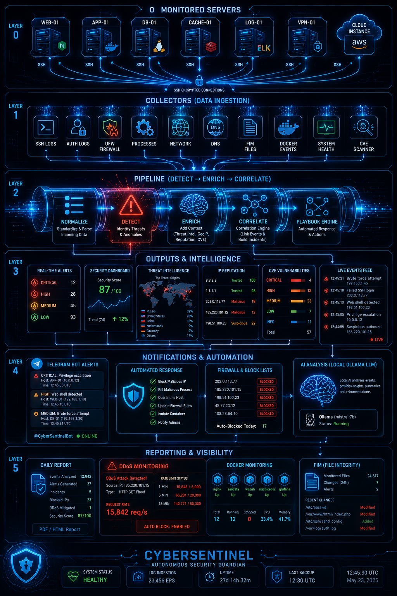
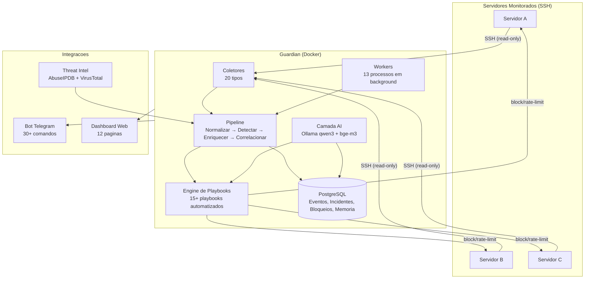
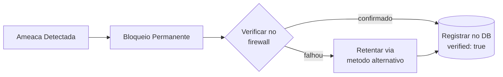
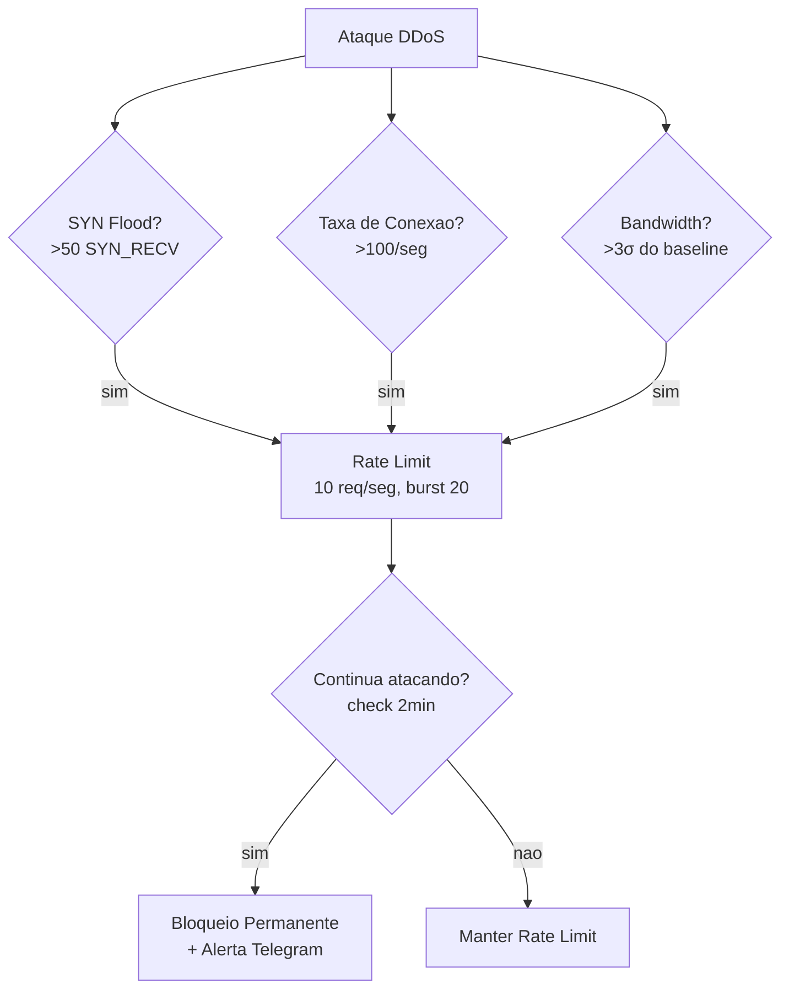
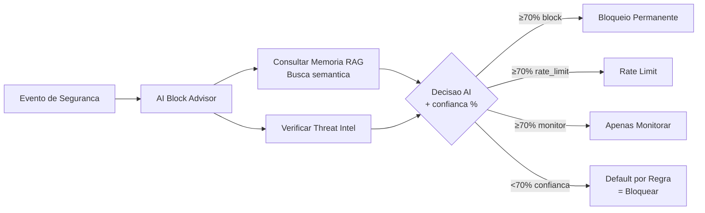
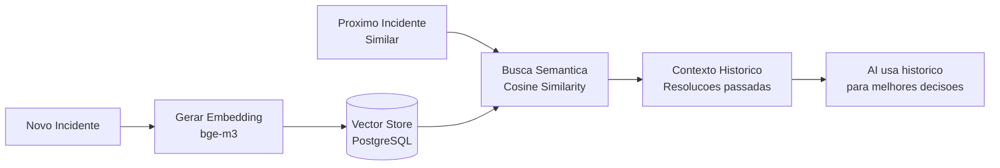
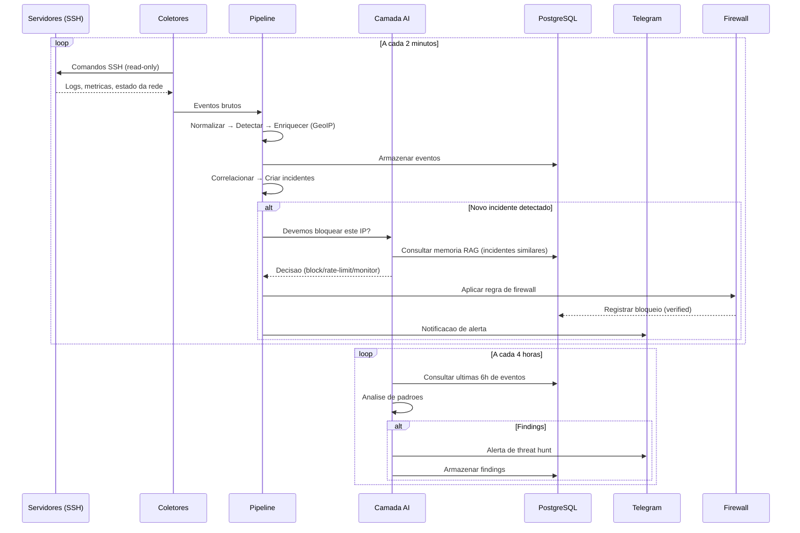

<p align="center">
  
</p>

<h1 align="center">Guardian Blue Team</h1>

<p align="center">
  <a href="https://github.com/afborda/guardian-blue-team/actions/workflows/ci.yml"></a>
  <a href="LICENSE"></a>
  <a href="https://ghcr.io/afborda/guardian-blue-team"></a>
  
</p>

<p align="center">
  <b>SIEM/SOAR Agentless com AI Local</b> — Detecta, Analisa, Bloqueia, Aprende<br>
  <a href="README.md"><strong>English</strong></a> · <a href="docs/getting-started.md">Instalacao</a> · <a href="docs/architecture.md">Arquitetura</a> · <a href="docs/configuration.md">Configuracao</a> · <a href="docs/GUARDIAN-LOG-COVERAGE.md">Cobertura de Logs</a>
</p>

<p align="center">
  
</p>

---

<p align="center">
  
</p>

---

**Guardian** e um SIEM/SOAR agentless que monitora seus servidores via SSH, detecta ameacas em tempo real, e responde automaticamente com bloqueios permanentes. Nenhum agente para instalar, nenhum setup complexo — aponte para seus servidores e ele comeca a protege-los.

Usa AI local (Ollama) para analise de ameacas, constroi memoria semantica de cada incidente (RAG com embeddings), caca ameacas proativamente a cada 4 horas, e fornece resposta graduada a DDoS com escalacao automatica.

---

## Como Funciona

```mermaid
flowchart LR
    subgraph Coleta["Coleta (a cada 2min — 20 coletores)"]
        direction TB
        SSH["SSH Auth\nUFW / Docker events"]
        NET["Rede\nConexoes / DNS"]
        PROC["Processos\nSudo / Pacotes"]
        SYS["Sistema\nKernel / Syslog\nDisco / Reboot"]
        APP["App Logs\nNginx / MySQL\nPostgres / Redis"]
        LOGIN["Historico de Login\nlast / lastb / w"]
        AUDIT["Audit / FIM\nSystemd / Containers"]
    end

    subgraph Pipeline["Pipeline de Processamento"]
        NORM[Normalizar\n25+ parsers]
        ML[ML Pre-score\nDGA + Markov]
        DETECT[Detectar\n24+ regras]
        ENRICH[Enriquecer\nGeo + Threat Intel]
        CORRELATE[Correlacionar\nIncidentes]
    end

    subgraph AI["Camada AI"]
        ADVISOR[Block Advisor\nblock / rate-limit / monitor]
        HUNTER[Threat Hunter\nScan proativo 4h]
        RAG[Memoria RAG\nEmbeddings + Historico]
    end

    subgraph Resposta["Resposta Automatica"]
        BLOCK[Bloqueio Permanente\nUFW / fail2ban]
        RATE[Rate Limit\niptables]
        ESCALATE[Escalar\nrate-limit → block]
        NOTIFY[Alerta Telegram]
    end

    Coleta --> NORM --> ML --> DETECT --> ENRICH --> CORRELATE
    CORRELATE --> ADVISOR
    ADVISOR -->|"block"| BLOCK
    ADVISOR -->|"rate_limit"| RATE
    ADVISOR -->|"monitor"| NOTIFY
    RATE -->|"ataque continua"| ESCALATE --> BLOCK
    HUNTER --> RAG
    CORRELATE --> NOTIFY
    BLOCK --> NOTIFY
```



---

## Comparativo

| | Fail2ban | CrowdSec | Wazuh | **Guardian** |
|-|----------|----------|-------|:------------:|
| Setup | 5 min | 30 min | 2+ horas | **30 segundos** |
| Agentes nos alvos | Sim | Sim | Sim | **Nao** |
| Decisoes com AI | — | — | — | **Local-first** |
| Aprende com incidentes | — | — | — | **RAG + Embeddings** |
| Deteccao DDoS | — | Parcial | — | **SYN/Rate/Bandwidth** |
| Caca proativa de ameacas | — | — | — | **A cada 4 horas** |
| ML comportamental | — | — | — | **Sim** |
| Alertas mobile-first | — | — | — | **Telegram** |
| Bloqueios permanentes | Config | Config | — | **Sempre** |

---

## Visao da Arquitetura



---

## Novidades na v3.1.1

| Feature | O que faz |
|---------|-----------|
| **Guardian Shell Auto-Sync** | Quando o `allowed-commands.txt` muda (novo template, correcao), o guardian-shell nos servidores monitorados e atualizado automaticamente via SSH — sem reinstalacao manual. Versao rastreada por hash de conteudo, estavel entre builds. |
| **20 coletores** | Adicionados: historico de login (`last`/`lastb`/`w`), erros de kernel/dmesg, logs de app (nginx/mysql/postgres/redis), disco critico, detector de reboot inesperado |
| **Auto-monitoramento** | O proprio host do Guardian (id=0) e monitorado pelo mesmo pipeline que todos os outros servidores |
| **CVE scan com Trivy** | Imagens de containers nos servidores monitorados sao escaneadas para CVEs a cada 6 horas (quando Trivy esta instalado) |
| **Re-scan CVE por trigger** | Eventos de instalacao/remocao de pacotes disparam re-scan imediato de CVE sem aguardar o ciclo de 6 horas |
| **24+ regras de deteccao** | Adicionadas: brute-force interativo, login em horario incomum, OOM kill, kernel panic, erro de hardware, sudo nao permitido, su brute-force, disco critico, reboot do sistema |
| **Hardening do /health** | Probe publica retorna apenas `{status: ok}` — status completo do DB exige token valido |

## Novidades na v3.0 / v2.1

| Feature | O que faz |
|---------|-----------|
| **Deteccao de Anomalia STL** | Decomposicao de serie temporal (tendencia + sazonal + residuo) em `load_ratio`, `mem_used_percent`, `network_rx/tx_bps`. Captura anomalias que limites fixos de σ deixam passar em metricas com ciclos diarios/semanais. Faz fallback para σ quando nao detecta periodo. |
| **Classificador DGA com ML** | Modelo ONNX de regressao logistica (sklearn → skl2onnx) com 11 features incluindo log-likelihood de bigrama. Treinado em Tranco top-1m + dominios sinteticos Conficker/Cryptolocker/Necurs. Dependencia opcional — faz fallback para heuristica de entropia se `onnxruntime-node` nao estiver instalado. Treine via `npm run train-dga`. |
| **Consenso TI + AI** | Decisoes de bloqueio agora exigem concordancia entre score de Threat Intel e recomendacao da AI. Categorias always-block (port_scan, brute_force, ddos, crypto_mining, lateral_movement) ignoram o gate mas ainda registram o sinal de TI para auditoria de FP. |
| **Embeddings bge-m3** | Memoria RAG migrada de `nomic-embed-text` para `bge-m3` (multilingual, 1024-dim). Re-embede incidentes historicos com `npm run reembed-incidents`. |
| **Feeds CVE Intel** | EPSS (probabilidade de exploracao) + CISA KEV (known-exploited) somam-se ao OSV.dev. Endpoint admin para forcar atualizacao. |

---

## Features Principais

### Bloqueio Permanente — Uma Vez Bloqueado, Sempre Bloqueado

Toda ameaca detectada e bloqueada permanentemente em todos os servidores. Sem TTL, sem auto-desbloqueio. Desbloqueio e apenas manual (via dashboard ou comando `/unblock`).



### Deteccao DDoS e Resposta Graduada



### Decisoes com AI



### Caca Proativa de Ameacas

A cada 4 horas, a AI do Guardian analisa as ultimas 6 horas de eventos buscando:
- Ataques coordenados de multiplos IPs
- Padroes de APT (slow-roll)
- Reconhecimento/scanning ativo
- Indicadores de movimento lateral
- Padroes de atividade incomuns

Findings sao armazenados em `threat_hunt_findings` e os de alta/critica severidade sao enviados ao Telegram imediatamente.

### Verificacao de Login com Inteligencia de IP

Quando um login SSH e detectado, Guardian envia notificacao no Telegram com:
- Servidor, usuario, metodo de autenticacao, fingerprint
- **Geolocalizacao do IP** (pais, ISP)
- **Score de reputacao** (AbuseIPDB + VirusTotal)
- Nivel de risco (Limpo / Suspeito / Alto Risco)
- Botoes de acao: ✅ Sou eu | ❌ NAO sou eu | 👁️ Monitorar

### RAG — Aprende com Cada Incidente



---

## Contra O Que Protege

| Categoria | Ameacas | Resposta |
|----------|---------|----------|
| **SSH / Login** | Brute force, usuarios invalidos, horarios incomuns, historico de login (`last`/`lastb`), movimento lateral, su brute-force | Bloqueio permanente |
| **DDoS** | SYN flood, pico de conexoes, anomalia de bandwidth | Rate-limit → Escalar → Bloquear |
| **Rede** | Port scanning, DGA C2 (classificador ML), TLDs suspeitos, flood de conexoes | Bloqueio permanente |
| **Anomalias Estatisticas** | Picos de CPU/memoria/rede via decomposicao STL (lida com ciclos diurnos) | Alerta + triagem AI |
| **Containers** | Tentativas de escape, crypto mining, crashloops, CVE em imagens (Trivy) | Kill + block + isolar |
| **Integridade** | /etc/passwd, sudoers, sshd_config, authorized_keys alterados | Alerta critico |
| **Supply Chain** | CVEs em pacotes instalados (OSV.dev + EPSS + CISA KEV) | Alerta + passos de remediacao |
| **Persistencia** | Cron jobs maliciosos, reverse shells, chaves SSH nao autorizadas | Alerta + bloquear |
| **Saude do Sistema** | OOM kills, kernel panic, erros de hardware, disco > 90%, reboot inesperado | Alerta + escalar |
| **App Logs** | Erros de Nginx / MySQL / PostgreSQL / Redis, HTTP scanning | Alerta |
| **Escalonamento de Privilegio** | Sudo negado (nao no sudoers), falha de autenticacao sudo, falhas PAM | Alerta + bloquear |

24+ regras de deteccao, 15+ playbooks automatizados.

---

## Workers (Processos em Background)

| Worker | Intervalo | Funcao |
|--------|----------|--------|
| Event Collector | 2 min | Coleta logs de todos servidores, roda pipeline |
| DDoS Escalation | 2 min | Verifica IPs com rate-limit, escala para bloqueio |
| Score Calculator | 5 min (metricas), 1h (scores) | Health + security scores |
| Threat Hunter | 4 horas | Analise proativa AI de padroes |
| Intelligence | 1 hora | Profiling comportamental ML |
| FIM | 4 horas | Monitoramento de integridade de arquivos |
| CVE Monitor | 6 horas | Scan de vulnerabilidades |
| Guardian Shell Sync | 6 horas | Atualiza automaticamente o guardian-shell nos servidores quando o allowlist muda |
| Block Cleanup | 5 min | Garante que todos bloqueios sao permanentes |
| Daily Report | 08:00 BRT | Resumo diario no Telegram |
| Metrics Retention | 24 horas | Remove dados com mais de 30 dias |
| Discovery | 24 horas | Auto-descobre novos servicos |
| Vuln Scanner | Semanal (Sab 09:00) | Scan profundo de vulnerabilidades |

---

## Consumo de Recursos

| Componente | RAM | Disco | CPU |
|-----------|-----|-------|-----|
| Guardian (app) | 50-100 MB | 200 MB | 0.5 core |
| PostgreSQL | 64-256 MB | 500 MB-2 GB | 0.2 core |
| Ollama (AI local) | 4-6 GB | 3 GB | 2 cores (pico) |
| **Total sem AI** | **~300 MB** | **~2 GB** | **1 core** |
| **Total com AI** | **~6 GB** | **~5 GB** | **2 cores** |

Nao quer AI local? Configure `GEMINI_API_KEY` — tier gratuito do Google funciona. Ou defina `AI_STRATEGY=api-only`.

---

## Quick Start (5 minutos)

### 1. Clone e Configure

```bash
git clone https://github.com/afborda/guardian-blue-team.git
cd guardian-blue-team
cp .env.example .env
```

Edite `.env`:

```env
TELEGRAM_BOT_TOKEN=seu_token_do_botfather
TELEGRAM_CHAT_ID=seu_chat_id
GUARDIAN_BASE_URL=https://guardian.seudominio.com
GUARDIAN_DB_PASSWORD=senha_forte_aqui
DASHBOARD_TOKEN=string_aleatoria_para_acesso_web

# AI (escolha um ou ambos):
GEMINI_API_KEY=sua_chave_google_ai_gratis    # Fallback API
AI_STRATEGY=auto                              # auto | local-only | api-only

# Threat Intel (opcional mas recomendado):
ABUSEIPDB_API_KEY=sua_chave_gratis
```

### 2. Inicie

```bash
docker compose up -d
```

Aguarde 2-3 minutos para Ollama baixar modelos AI (`qwen3:4b` + `bge-m3`).

### 3. Adicione Servidores

Envie `/help` para seu bot no Telegram. Depois:

```
/add-server meuserver 1.2.3.4 22 root
```

Guardian gera uma chave SSH, mostra a chave publica para adicionar ao alvo, e comeca a monitorar imediatamente.

### O Que Acontece Automaticamente

```mermaid
gantt
    title Timeline de Startup do Guardian
    dateFormat X
    axisFormat %s

    section Imediato
    Health check : 0, 5
    Webhook Telegram : 0, 3
    
    section 30 segundos
    Coleta de eventos : 10, 30
    Coleta de metricas : 10, 30
    
    section 5 minutos
    Primeira caca de ameacas : 300, 360
    Calculo de scores : 300, 360
    
    section Contínuo
    Coleta a cada 2min : 120, 900
    Check DDoS a cada 2min : 120, 900
    AI hunting a cada 4h : 600, 900
```



---

## Estrategia de AI

Guardian suporta tres modos de AI via `AI_STRATEGY`:

| Modo | Comportamento |
|------|----------|
| `auto` (padrao) | Ollama primeiro → Gemini → OpenAI → Claude |
| `local-only` | Apenas Ollama (totalmente offline, nenhum dado sai do servidor) |
| `api-only` | Apenas APIs cloud (quando nao tem GPU para Ollama) |

AI e usada para:
- Decisoes de bloqueio (AI Block Advisor)
- Caca proativa de ameacas (a cada 4h)
- Analise de incidentes (comando `/ask`)
- Relatorios diarios
- Contexto de verificacao de login

Se AI estiver completamente indisponivel, Guardian faz fallback para defaults baseados em regras (sempre bloqueia).

---

## Fluxo de Dados — Ponta a Ponta



---

## Bot Telegram — 30+ Comandos

### Resposta a Incidentes (Botoes de Acao)

Todo incidente vem com botoes inline:

| Botao | Acao |
|--------|--------|
| ✅ Resolver | Marcar como tratado |
| 🚫 Falso Positivo | Dispensar + Guardian aprende (RAG) |
| 🔒 Bloquear IP | Bloqueio permanente no firewall |
| 🔍 Threat Intel | Reputacao do IP + recomendacao AI |

### Comandos Principais

| Comando | O que faz |
|---------|-----------|
| `/status` | Todos servidores de relance |
| `/incidents` | Incidentes abertos com botoes de acao |
| `/threat 1.2.3.4` | Reputacao do IP + geo + recomendacao |
| `/block 1.2.3.4` | Bloqueio permanente em todos servidores |
| `/unblock 1.2.3.4` | Remover bloqueio (apenas manual) |
| `/verify-blocks` | Verificar todos bloqueios existem nos firewalls |
| `/ask qualquer pergunta` | Analista AI responde com contexto |
| `/events` | Eventos de seguranca recentes |
| `/scores` | Scores de seguranca por servidor |
| `/report` | Relatorio de seguranca |
| `/vulns` | Vulnerabilidades CVE |
| `/dashboard` | Token temporario de acesso |
| `/help` | Todos os comandos |

---

## Dashboard

Dashboard web com 12 paginas:

**Visao Geral** · **Fleet Health** · **Scores** · **Incidentes** · **Servidores** · **CVE** · **Bloqueios** · **Logs** · **Timeline** · **Mapa de Ataques** · **Status API** · **Inteligencia**

Acesso: `https://seu-dominio/dashboard?token=TOKEN`

---

## Tech Stack

| Camada | Tecnologia |
|-------|-----------|
| Runtime | Node.js 20 + TypeScript |
| Banco de Dados | PostgreSQL 16 |
| AI (local) | Ollama + qwen3:4b + bge-m3 |
| AI (cloud) | Gemini / OpenAI / Claude (failover) |
| Firewall | UFW + fail2ban + iptables |
| Alertas | Telegram Bot API |
| Monitoramento | SSH (agentless) |
| Container | Docker + Docker Compose |
| Reverse Proxy | Traefik (HTTPS) |

---

## Documentacao

| Doc | Descricao |
|-----|-----------|
| [Instalacao](docs/getting-started.md) | Requisitos, passo-a-passo, troubleshooting |
| [Arquitetura](docs/architecture.md) | Diagramas de pipeline, estrutura de pastas |
| [Configuracao](docs/configuration.md) | Todas as variaveis de ambiente |
| [Features de Seguranca](docs/security-features.md) | Regras de deteccao, playbooks |
| [Inteligencia ML](docs/ml-intelligence.md) | Baselines comportamentais, scoring |
| [Memoria RAG](docs/rag-memory.md) | Como Guardian aprende com incidentes |
| [Comandos Telegram](docs/telegram-commands.md) | Todos os comandos com exemplos |
| [Dashboard](docs/dashboard.md) | Paginas, acesso, features |

---

## Contribuindo

Contribuicoes sao bem-vindas! Abra uma issue primeiro para discutir.

## Licenca

[AGPL-3.0](LICENSE)
