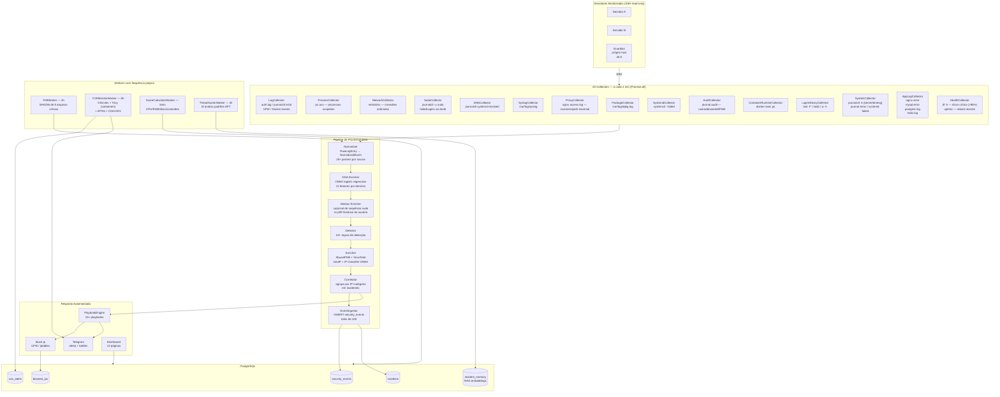

# Guardian — Cobertura de Logs (v3.1.1)

> Documento atualizado em 2026-06-01. Reflete o estado real do código após a sessão de implementação que fechou as principais lacunas identificadas em `GUARDIAN-LOGS.md`.

---

## Fluxo Completo de Coleta



---

## Tabela Completa — O que coletamos hoje

### Autenticação e Acesso

| Fonte | Comando SSH | Eventos gerados | Collector |
|-------|-------------|-----------------|-----------|
| SSH auth.log | `journalctl -u ssh -n 500` / `/var/log/auth.log` | `ssh_failed_password`, `ssh_invalid_user`, `ssh_login_success`, `session_opened`, `ssh_breakin_attempt` | `log-collector.ts` |
| Sudo | `journalctl -u sudo -n 200` | `sudo_command`, `sudo_not_allowed`, `sudo_auth_failure` | `sudo-collector.ts` |
| Login history (`last`) | `last -F -n 50` | `interactive_session_active`, `interactive_session_history` | `login-history-collector.ts` |
| Tentativas falhas (`lastb`) | `sudo lastb -F -n 50` | `interactive_login_failed` (via detector: `interactive_brute_force`) | `login-history-collector.ts` |
| Sessões ativas agora (`w`) | `w -h` | `interactive_session_active` | `login-history-collector.ts` |
| PAM / `su` | auth.log | `su_auth_failure`, `pam_auth_failure` | `log-collector.ts` |
| Mudanças de usuário | `journalctl` + audit | `audit_user_change` (useradd, userdel) | `audit-collector.ts` |

### Rede e Firewall

| Fonte | Comando SSH | Eventos gerados | Collector |
|-------|-------------|-----------------|-----------|
| UFW | `/var/log/ufw.log` | `firewall_block` (IP, porta, protocolo) | `log-collector.ts` |
| Conexões ativas | `ss -tupn` / `netstat` | `HIGH_CONN_COUNT`, `SYN_FLOOD`, `BANDWIDTH_SPIKE` | `network-collector.ts` |
| DNS queries | `journalctl -u systemd-resolved` | `dns_query` + DGA score ONNX | `dns-collector.ts` |
| Proxy/HTTP | nginx access log | `proxy_path_traversal`, `proxy_scanner_detected` | `proxy-collector.ts` |

### Sistema e Kernel

| Fonte | Comando SSH | Eventos gerados | Collector |
|-------|-------------|-----------------|-----------|
| Kernel/dmesg | `journalctl -k -n 100` | `oom_kill`, `kernel_panic`, `hardware_error` | `system-collector.ts` → `collectAsRawEntries()` |
| Journal erros | `journalctl -p err -n 100` | `journal_error` (erros de nível error/critical) | `system-collector.ts` → `collectAsRawEntries()` |
| Systemd failed | `systemctl --failed` | `service_failed` | `system-collector.ts` → `collectAsRawEntries()` |
| Syslog | `/var/log/syslog` | `syslog_oom_kill`, `syslog_service_crash` | `syslog-collector.ts` |
| Disco crítico | `df -h` | `disk_full` (partições > 90%) → detector: `disk_space_critical` | `health-collector.ts` → `collectCriticalDiskEntries()` |
| Reboot recente | `uptime` | `system_reboot` (uptime < 30 min) → detector: `unexpected_reboot` | `health-collector.ts` → `collectRebootEntry()` |

### Logs de Aplicação

| Fonte | Comando SSH | Eventos gerados | Collector |
|-------|-------------|-----------------|-----------|
| nginx error | `sudo tail -n 100 /var/log/nginx/error.log` | `nginx_error` (erros críticos) | `app-log-collector.ts` |
| nginx access | `sudo tail -n 100 /var/log/nginx/access.log` | `nginx_access` (apenas 4xx/5xx) | `app-log-collector.ts` |
| MySQL | `sudo journalctl -u mysql -n 50` | `mysql_error` | `app-log-collector.ts` |
| PostgreSQL | `sudo journalctl -u postgresql -n 50` | `postgres_log` | `app-log-collector.ts` |
| Redis | `sudo journalctl -u redis -n 50` | `redis_log` | `app-log-collector.ts` |

### Processos e Pacotes

| Fonte | Comando SSH | Eventos gerados | Collector |
|-------|-------------|-----------------|-----------|
| Processos suspeitos | `ps aux` | `suspicious_process` (xmrig, netcat reverso, /tmp executáveis) | `process-collector.ts` |
| Pacotes | `/var/log/dpkg.log` | `package_suspicious`, `package_installed`, `package_removed` | `package-collector.ts` |
| Systemd units | `systemctl --failed` + journal | `systemd_unit_failed` | `systemd-collector.ts` |
| Audit kernel | journal audit | `audit_user_change`, PAM events | `audit-collector.ts` |

### Containers (Docker)

| Fonte | Comando SSH | Eventos gerados | Collector |
|-------|-------------|-----------------|-----------|
| Docker events | `docker events` | `docker_die`, `docker_kill`, `docker_start`, `docker_exec` | `log-collector.ts` |
| Processos em containers | `docker exec ps` (2 min) | `container_process_list` | `container-runtime-collector.ts` |
| CVE em imagens | Trivy (quando instalado, 6h) | `container_image_cve` com CVSS e pacote | `container-image-collector.ts` via `CVEMonitorWorker` |

### Integridade de Arquivos (FIMWorker — 4h)

| Arquivo monitorado | Evento gerado |
|--------------------|--------------|
| `/etc/passwd` | `file_modified` |
| `/etc/shadow` | `file_modified` |
| `/etc/sudoers` | `file_modified` |
| `/etc/ssh/sshd_config` | `file_modified` |
| `/etc/hosts` | `file_modified` |
| `/root/.ssh/authorized_keys` | `file_modified` |
| `/etc/crontab` | `file_modified` + `cron_added`/`cron_removed` |
| `/etc/ld.so.preload` | `file_modified` (indicativo de rootkit) |

### Vulnerabilidades e Inteligência (CVEMonitorWorker — 6h)

| Fonte | Frequência | O que coleta |
|-------|-----------|-------------|
| OSV.dev | 6h | CVEs nos pacotes instalados dos servidores |
| CISA KEV | Diário 03:17 UTC | Known Exploited Vulnerabilities |
| EPSS | Diário | Score de probabilidade de exploração (0.0–1.0) |
| Trivy | 6h (opcional) | CVE em imagens Docker nos servidores |
| AbuseIPDB | Por evento com IP | Score de abuso (0–100) |
| VirusTotal | Por evento crítico com IP | # de vendors marcando como malicioso |

---

## Detecções Ativas (Detector — 24+ regras)

```
AUTENTICAÇÃO
✅ ssh_brute_force_burst        — 20+ falhas SSH de mesmo IP no buffer
✅ lateral_movement             — sucesso após tentativas de brute force
✅ interactive_brute_force      — 5+ lastb failures do mesmo IP em 2h
✅ unusual_hour_interactive_login — login SSH fora de horário comercial (00h–06h)
✅ su_brute_force               — 3+ falhas de su para mesmo usuário

REDE
✅ port_scan                    — 10+ portas distintas de mesmo IP em 30min
✅ syn_flood_detected           — >50 conexões SYN_RECV
✅ high_connection_flood        — alto número de conexões simultâneas
✅ proxy_scanner_burst          — 10+ requests de scanner em janela

SISTEMA
✅ oom_kill_detected            — kernel OOM killer ativado
✅ kernel_panic_detected        — kernel panic (crítico)
✅ hardware_error_detected      — erro de hardware detectado pelo kernel
✅ sudo_privilege_escalation_denied — sudo negado (NOT in sudoers)
✅ disk_space_critical          — partição > 90% usada
✅ unexpected_reboot            — uptime < 30 min (reboot recente)
✅ service_failed               — unit systemd em estado failed

CONTAINERS / PROCESSOS
✅ suspicious_process           — xmrig, netcat reverso, /tmp executáveis
✅ container_escape_attempt     — processo com capabilidades elevadas incomuns
✅ crypto_mining_detected       — processo ou conexão de pool de mining

INTELIGÊNCIA / ML
✅ dga_domain_detected          — domínio com score DGA > threshold
✅ markov_anomaly               — sequência sudo acima do p99 histórico do usuário
✅ anomaly_metrics_detected     — métricas fora de 3σ (STL decomposition)
✅ ip_threat_score_high         — ML IP Classifier score > 0.6
```

---

## O que ainda NÃO coletamos (lacunas conhecidas)

| Fonte | Impacto | Prioridade |
|-------|---------|-----------|
| `/var/log/secure` (RHEL/Fedora) | Brute force invisível em servidores Red Hat | Alta — Tier 3 |
| `auditd` syscall completo | Todos os `execve`, `openat`, `connect` — base anti-evasão | Alta |
| Janela 24h para low-and-slow brute force | 1 tentativa/5min nunca atinge threshold | Alta |
| Agrupamento /24 CIDR para botnets | 1 tentativa por IP diferente do mesmo bloco passa invisível | Alta |
| `systemctl --user list-timers` | Persistência via systemd timer de usuário | Média |
| `sudo -l` periódico + diff | Detectar escalação silenciosa de privilégio via `visudo` | Média |
| IPv6 /64 prefix normalization | Brute force IPv6 distribuído | Média |
| DNS tunneling (subdomínio volume) | Exfiltração via DNS — diferente de DGA | Média |
| Logs de containers (`docker logs`) | Ataques a apps dentro dos containers | Baixa |
| Tor exit nodes blocklist | IPs Tor mudam sempre, ML não acumula histórico | Baixa |

---

## Automonitoramento do Guardian

O Guardian monitora a si mesmo como um servidor especial com `id=0` e `name='local'`. Todos os 20 collectors rodam no host local a cada 2 minutos. As diferenças em relação a servidores externos:

- `updateLastSeen()` não é chamado (não há linha no banco com `id=0`)
- Lógica de auto-block não se aplica (`syncAllBlocks()` itera apenas servidores do DB)
- Os eventos gerados têm `serverId=0` na tabela `security_events`

---

## Referência rápida de arquivos

| Collector | Arquivo |
|-----------|---------|
| Auth/UFW/Docker | `src/collectors/log-collector.ts` |
| Processos suspeitos | `src/collectors/process-collector.ts` |
| Rede/conexões | `src/collectors/network-collector.ts` |
| Sudo | `src/collectors/sudo-collector.ts` |
| DNS | `src/collectors/dns-collector.ts` |
| Syslog | `src/collectors/syslog-collector.ts` |
| Proxy/HTTP | `src/collectors/proxy-collector.ts` |
| Pacotes | `src/collectors/package-collector.ts` |
| Systemd | `src/collectors/systemd-collector.ts` |
| Audit | `src/collectors/audit-collector.ts` |
| Containers | `src/collectors/container-runtime-collector.ts` |
| Login history | `src/collectors/login-history-collector.ts` |
| Kernel/journal/systemd | `src/collectors/system-collector.ts` |
| Nginx/MySQL/Postgres/Redis | `src/collectors/app-log-collector.ts` |
| Disco/reboot | `src/collectors/health-collector.ts` |
| CVE em imagens | `src/collectors/container-image-collector.ts` |
| Pipeline entry point | `src/workers/event-collector.worker.ts` |
| Normalizer (25+ parsers) | `src/pipeline/normalizer.ts` |
| Detector (24+ regras) | `src/pipeline/detector.ts` |
| Persistência no banco | `src/pipeline/ingestor.ts` |
